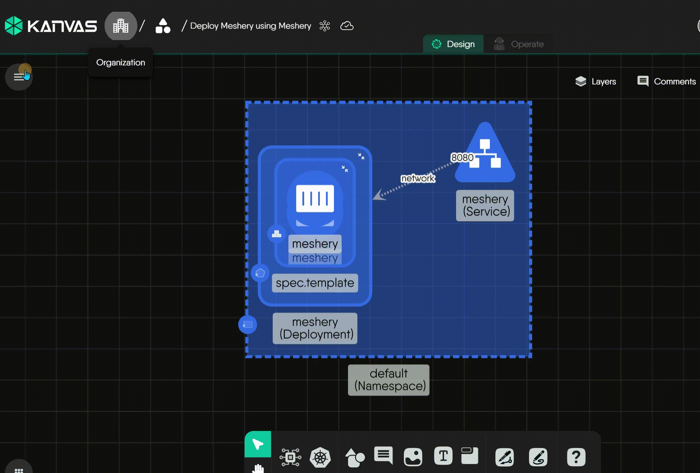

# Embedding Designs

Learn how to embed your designs for sharing on your sites.

Meshery Design Embedding enables you to export a design in a format that can be seamlessly integrated into websites, blogs, or platforms supporting HTML, CSS, and JavaScript. This embedded version provides an interactive representation of the design, making it easier to share with infrastructure stakeholders.

## Embedding Your Design

To embed your Kanvas design, follow these steps:

1. **Access Embed Option**: Within the [Kanvas Designer](https://kanvas.new/), select the design you wish to embed. Click on the export icon in the menu for the selected design. The export modal will appear, click on the "Embed" option.

   

2. **Download the Embedding Script**: Click on the download icon presented in the same modal to download the embedding script.

## Embedding in Static Sites

   The embed code for static site:

   ```html
   <div id="embedded-design-embedding-example"></div>
   <script src="./embedded-design-embedding-example.js" type="module"></script>
   ```

   Make sure the `src` attribute in the script tag points to the location of the downloaded embedding script on your local filesystem or server.

### Customization

You can customize the styles for the embedded design in two ways: globally via CSS classes, or for a single instance via an inline style parameter.

#### Global Styling (via CSS Classes)

For advanced global styling, you can override the default CSS rules in your site's stylesheet. This will affect all embedded designs on your site. The main classes are:

- `.meshery-embed-container`: The main container for the embedded design. You can target its `.full` or `.half` variants for specific sizing adjustments.
- `.cy-container`: The canvas element within the container where the design itself is rendered.

Here is an example of how you could override these classes:

```html
<style>
  /* Make all embed containers have a different border and background */
  .meshery-embed-container {
    border: 2px solid #00B39F;
    background-color: #f5f5f5;
  }
</style>
```

#### Instance-specific Styling (via `style` Parameter)

For styling a single instance, the recommended method is to use the `style` parameter directly in the shortcode. This provides maximum control and will override any default styles or global CSS.

```html

```

## Embedding in React Projects

1. **Install the Package**: To integrate the Meshery Design into your React project, start by installing the package via npm:

```bash
  npm i meshery-design-embed
```

2. **Incorporate the Component**: Use the component to seamlessly embed designs within React and its associated frameworks.

```jsx
import MesheryDesignEmbed from '@layer5/meshery-design-embed'

function Design() {
  return (
    <>
      <div>
        <MesheryDesignEmbed
          embedScriptSrc="embedded-design-embed1.js"  // path to the embed script
          embedId="embedded-design-a3d3f26e-4366-44e6-b211-1ba4e1a3e644" // id of the embedding
        />
      </div>
    </>
  );
}
```

Make sure the `embedScriptSrc` attribute in the component points to the location of the downloaded embedding script on your react filesystem.
Usually the script is located "static" folder

## Embedding with Hugo

To prepare your Hugo site to support design embedding, perform the one-time task of adding the following shortcode definition to your site's set of supported shortcodes.

### Shortcode Definition

<details>
<summary>Click to expand the full Shortcode Definition</summary>

```html
{{ $script := .Get "src" }}
{{ $id := .Get "id" }}
{{ $size := .Get "size" | default "full" }}
{{ $style := .Get "style" }}

<style>
.meshery-embed-container {
  border: 1px solid #eee;
  border-radius: 4px;
  margin: 0rem auto;
  box-shadow: 0 1px 3px rgba(0,0,0,0.1);
}
.meshery-embed-container.full {
  width: 80%;
  height: 30rem;
}
.meshery-embed-container.half {
  width: 50%;
  height: 25rem;
}
.meshery-embed-container .cy-container {
  width: 100%;
  height: 100%;
}
</style>

<div
    id="{{ $id }}"
    {{- if $style -}}
        style="{{ $style | safeCSS }}"
    {{- else -}}
        class="meshery-embed-container {{ $size }}"
    {{- end -}}
></div>

<script src="{{ $script }}" type="module"></script>
```

</details>

### Shortcode Explanation

- **`src`** (Required): The path to the exported JavaScript file for your design.
- **`id`** (Required): A unique ID for the embedded design container.
- **`size`** (Optional): A preset for simple sizing.
  - Accepts `"full"` (default) or `"half"`.
  - This parameter is ignored if `style` is used.
- **`style`** (Optional): For advanced customization.
  - Allows you to provide any custom CSS inline styles.
  - **This parameter has higher priority and will override the `size` parameter.**

Now that your site has shortcode support for embedding Kanvas designs, you can use the `meshery-design-embed` shortcode in any Hugo markdown file where you want to display embedded designs to your site visitors.

### Using the Shortcode

To embed a Meshery Design in your Hugo pages, use the `meshery-design-embed` shortcode. You will need the design's exported JavaScript file and its unique ID.

### Usage Examples

Place the exported `.js` file in an appropriate folder (e.g., a nearby `images` folder) and reference it in the shortcode.

**Default (full-width) display:**

```html

```

**Half-width display:**

```html

```

**Custom styling:**

```html

```

### Embedded Design Example

When Hugo builds your website, it will process the shortcode and generate the necessary HTML and JavaScript to embed the interactive Kanvas design.

Here's an example of how an embedded design appears:

<!-- Design Embed Container  -->
```html

```


