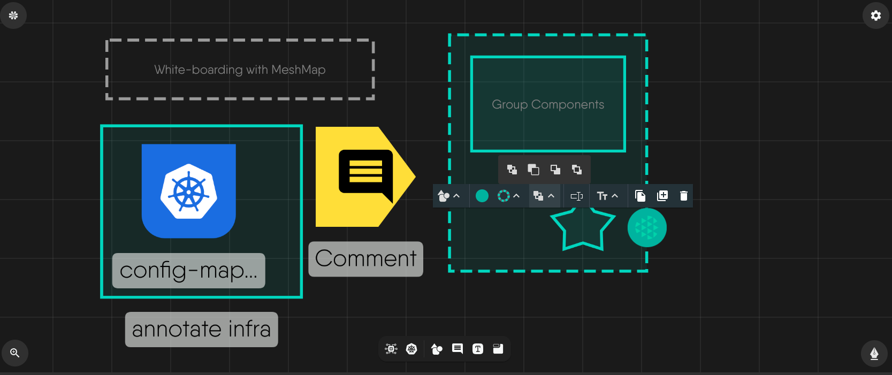
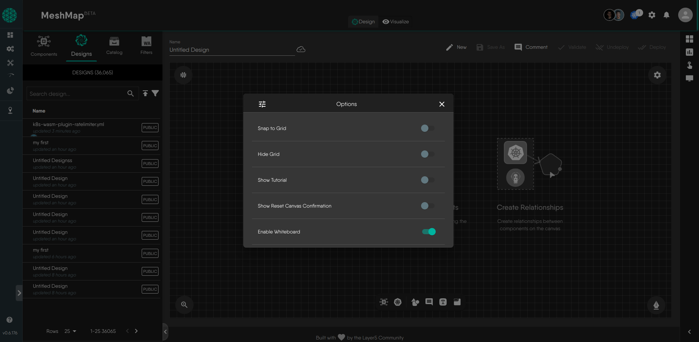
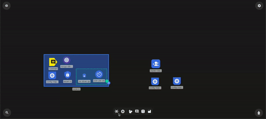
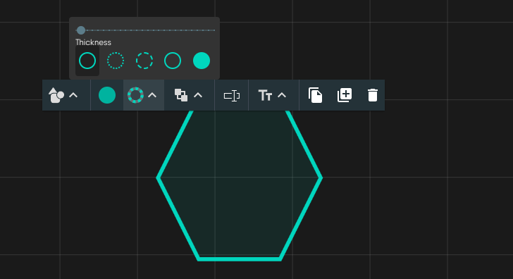
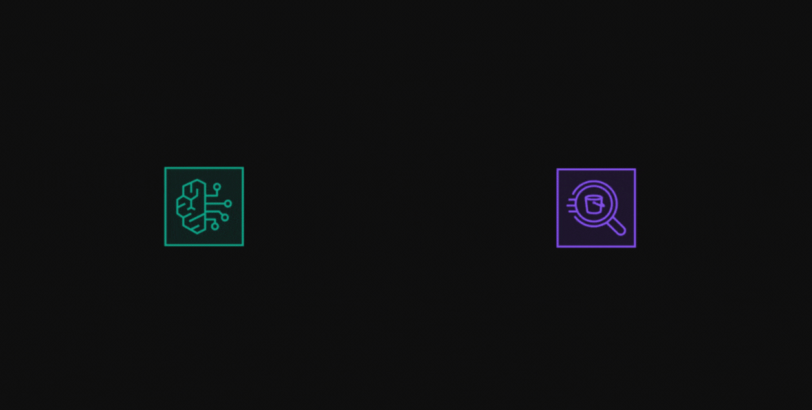
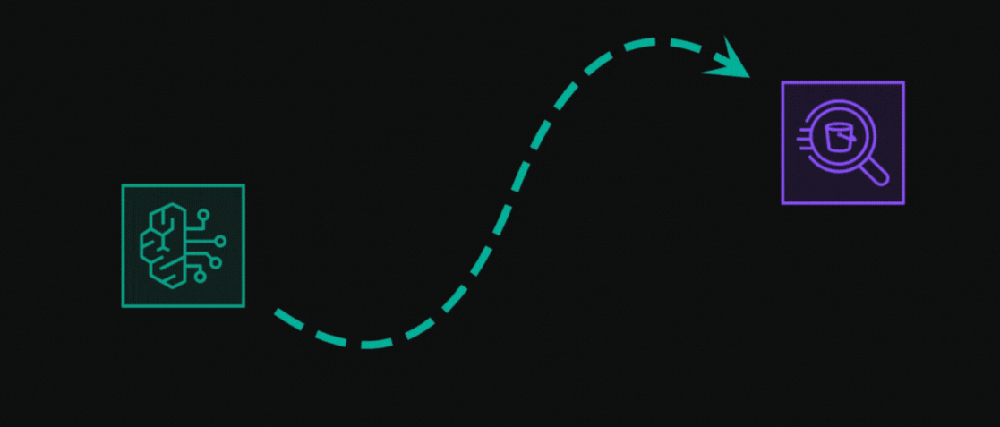

# Whiteboarding

Whiteboarding and Freestyle Drawing inside Kanvas

# Should this page every be relocated, please create a redirect link from the old location to the new location or backlinks like the one below will break

# <https://github.com/layer5labs/meshery-extensions/tree/master/kanvas/src/components/designer/drawer/ComponentDrawerTabContent/exportModal.js>

---

The whiteboarding feature introduces versatile, freestyle drawing capabilities within Kanvas. Enabling the whiteboard feature augments your ability to diagram with a suite of predefined shapes, and pen and pencil annotation, allowing you full freedom of expression of your engineering diagrams.

## Key Functionality

1. **Drawing Tools Integration**
   - Incorporates a comprehensive set of drawing tools resembling popular whiteboard applications.
   - Enables you to draw shapes, group components , annotate, and highlight specific elements within the infrastructure design canvas.
2. **Real-time Collaboration**
   - Facilitates simultaneous collaboration among multiple users within the tool.
   - Supports live editing and instant visualization of changes made by collaborators.
3. **Non-Invasive Annotations**
   - Annotations, shapes, or drawings created within the tool remain separate visual aids, not altering the actual infrastructure components.

## Enable the Whiteboarding Beta Feature

If not already enabled, follow these steps to access the whiteboarding feature within Kanvas:

### Step 1: Accessing Preferences

1. Navigate to canvas preferences and enable "Whiteboard Beta"

1. **Toggle Whiteboard Feature**
   1. Inside the 'Preferences' menu, find the section related to 'Canvas Settings' or 'Features'.
   1. Look for the option labeled 'Whiteboard' or similar.
1. **Activate the Whiteboard**
   1. Toggle the switch or checkbox next to 'Whiteboard' to enable this feature.

### Step 2: Confirmation and Access

2. **Accessing Whiteboard**
   1. Once enabled, exit the Preferences menu.
   1. Look for a new bottom dock which houses shapes , annotations and other whichboarding tools .

### Step 3: Utilizing Whiteboard Tools

3. **Explore Drawing Tools**
   1. Access the newly enabled whiteboard tools within the canvas interface.
   1. Experiment with drawing, annotation, and collaboration functionalities available in the whiteboard toolbar.

4. **Collaborative Usage**
   1. Share access with collaborators or team members to engage in real-time collaborative drawing sessions.

{}
The Whiteboard (Beta) feature might undergo updates or improvements during its beta phase. Provide feedback or report issues encountered while using the whiteboard to contribute to its refinement.
{}

### Feature Highlights

- **Diverse Drawing Capabilities**

  - Shapes, text, and annotation tools for expressive design enhancements.

- **Effortless Collaboration**

  - Seamless real-time collaboration empowers teams to brainstorm and iterate designs collectively.
  - Identification of collaborators through avatars ensures clarity in collaborative sessions.

- **Preservation of Infrastructure Integrity**
  - Annotations exist solely as visual overlays, leaving the underlying infrastructure unaltered.
  - Undo/Redo functionalities allow for design exploration without permanent modifications.

### Customizing Annotations and Shapes

#### Shape Customization

Shapes within the canvas offer flexibility. Select any shape to access a tooltip with options to resize, reshape, and change colors. This allows for precise adjustments similar to popular design software.

#### Text Annotation Customization

Text annotations come with various options. Customize fonts, sizes, alignments, and styles easily. Text boxes resize for seamless integration with the canvas.

#### Interactive Tooltip Interface

The tooltip is your gateway to customization. It's simple and intuitive, offering a range of editing options upon selection. It's designed for easy navigation, mirroring popular design software.

#### Advanced Customization Features

Manage layers, group elements, for better organization. These advanced tools ensure collaborative work while preserving design integrity.

#### Customizing Line Styles

You have the flexibility to customize lines to fit your design needs and architectural specifications. Lines can represent various relationships, such as data flow, dependencies, or communication between components. By adjusting line properties like curve style, arrow style, and line type (e.g., solid or dashed), you can visually convey different meanings, making your design easier for others to interpret. Use the design tooltip to adjust these visual elements and create clear, meaningful connections between components in your architecture.

#### Adding Line Animations

Take your designs a step further by adding animations to the lines, like the `marching ants` effect, to emphasize flow or movement between components. This feature improves visual clarity by highlighting the direction and movement of processes or data throughout your system, making interactions more intuitive. Adding this animation is simple, just click on the line and use the design tooltip.

#### Consistent Functionality

The customization tools apply uniformly to all annotation types. Changes made within the tooltip reflect instantly on the canvas, facilitating real-time collaboration.

### Benefits

1. **Enhanced Communication**
   - Facilitates clearer communication by allowing visual annotations on specific design components.
   - Reduces ambiguity and ensures better understanding of design intentions.

2. **Efficient Collaborative Workflows**
   - Real-time collaboration accelerates feedback loops, enhancing team productivity.
   - Enables instant sharing of ideas and design iterations among team members.

3. **Safe Environment for Creativity**
   - Offers a risk-free environment for drawing, experimenting, and ideation without impacting the actual infrastructure.
   - Encourages creativity and exploration within the design canvas.

### Use Cases

- **Team Collaboration:** Multiple users collaborating on infrastructure designs, adding annotations and insights simultaneously.
- **Educational Context:** Instructors and students using the tool for visualizing concepts or workflows in remote learning environments.
- **Architecture and Healthcare Planning:** Professionals in architecture or healthcare visualizing and annotating designs collaboratively.

### Conclusion

The whiteboarding and freestyle drawing feature enriches Kanvas's visual infrastructure designer tool by seamlessly integrating drawing capabilities without compromising the integrity of the underlying infrastructure. Its versatility in enabling real-time collaboration, preserving data integrity, and fostering a safe creative space positions it as a powerful asset for effective communication, efficient collaboration, and innovative ideation within diverse professional settings.
